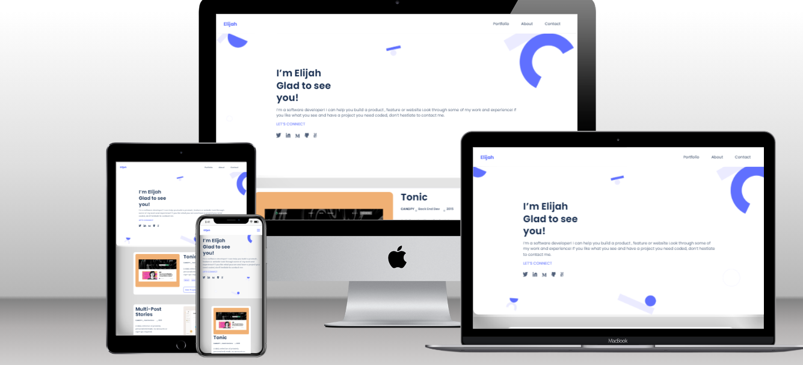

# Elijah Odjegba Portfolio

> This is my working portfolio. Inside you will find my background information, contact information, and my recent projects.


## Built With 🛠️

<<<<<<< HEAD
- [x] Language: HTML,CSS and JavaScript
- [x] Linters: Lighthouse, Webhint, Stylelint and ESLint
- [x] Code Editor: VS Code
- [x] Figma [Template 1](https://www.figma.com/file/l7SqJ3ZfkAKih9sFxvWSR4/Microverse-Student-Project-1?node-id=0%3A1)

## Website Mockup 📱 💻 🖥️

=======
- HTML
- CSS
- Javascript
>>>>>>> 87076fd341c641bb49d875a9b966f9f3d257caf1

## Live Demo

Click here - [Live Demo](https://elijahdre.github.io/My_Portfolio/)

## Getting Started
To get a local copy up and running follow these simple steps.

### Prerequisites

- [x] A web browser like Google Chrome.
- [x] A code editor like Visual Studio Code with Git and Node.js.

You can check if Git is installed by running the following command in the terminal.
```
$ git --version
```

Likewise for Node.js and npm for package installation.
```
$ node --version && npm --version
```

### Setup
Clone the repository using the GitHub link provided below.

### Install
In the terminal, go to your file directory and run this command.

```
$ git clone git@github.com:Elijahdre/My_Portfolio.git
```

### Run tests
To check for linters, use the files provided by [Microverse](https://github.com/microverseinc/linters-config). A GitHub action is also set to run during pull request.
```
$ npm install
```

## Usage
Kindly modify the files as needed. This website demonstrates both desktop and mobile versions.

## Deployment
This app is deployed in the GitHub Pages for easy viewing upon merged on the main branch.
Please find the link in the Live Demo section.


## Author

👤 **Elijah Odjegba** 

  - GitHub: [](https://github.com/Elijahdre)
  - Twitter: [](https://twitter.com/kingglijah)
  - LinkedIn: [](https://www.linkedin.com/in/elijah-odjegba-862708179/)


 **Petro Lesapiti**

- GitHub: [Loltolo-Lesapiti](https://github.com/Loltolo-Lesapiti)
- Twitter: [@Loltolo-Lesapiti](https://twitter.com/Loltolo-Lesapiti)
- LinkedIn: [Loltolo-Lesapiti](https://www.linkedin.com/in/Loltolo-Lesapiti/)

## 🤝 Contributing

Contributions, issues, and feature requests are welcome!

Feel free to check the [issues page](https://github.com/Elijahdre/My_Portfolio/issues).


## Show your support

Give a ⭐️ if you like this project!

## Acknowledgments

- [Microverse](https://www.microverse.org/)
- Code Reviewers
- Coding Partners

## 📝 License

This project is [MIT](./MIT.md) licensed.